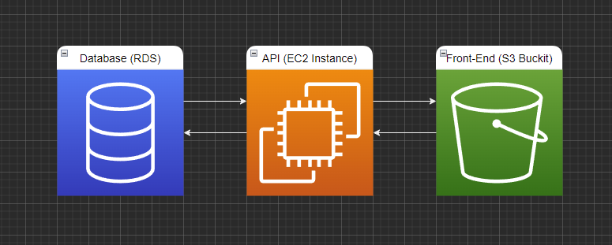

# App dependencies

The front-end is dependent on the Backend hosted on an EC2 instance to retrieve data and also to recieve user input data sent by the front-end.

The backend is dependent on the Database to store and retrieve the data.

Thus the most acceptable way to Deploy the app would be in the following order

Deploy:

1. Database
2. Backend
3. Front-End

When taking the app offline the oposite order would be the safest

EndProcess of :

1. Front-End
2. Backend
3. Database

## Deployment process

The app is dependent on a few key softwares to make the deployment process posible.

[CircleCi](https://circleci.com/) for the Continues integration process  
[AWS cli](https://aws.amazon.com/cli/) and Elastic Beanstalk to make the deploy the backend  
AWS cli to deploy the Front-End onto the S3 Buckit.
