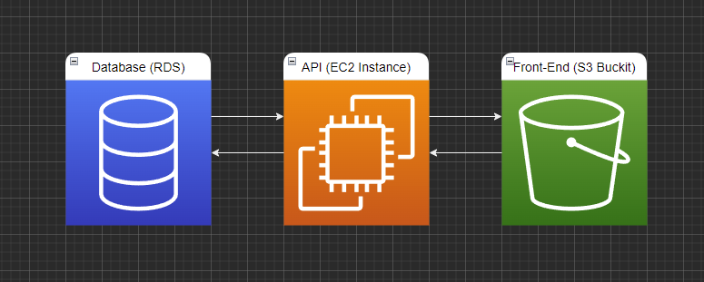

# Infrastructure Description



## The project consists of 3 git hub repositories

### `[ Ecommerse-Frontend---Angular ]` project

[Git repository](https://github.com/XsAndre-L/Ecommerse-Frontend---Angular)  
Front-End Project  
Deployed on S3 Buckit.

### `[ Storefront-Backend---Express ]` project

[Git repository](https://github.com/XsAndre-L/Storefront-Backend---Express)  
Backend Project  
Deployed on EC2 Instance

### `[ Dev-Ops-circleci ]` project

[Git repository](https://github.com/XsAndre-L/Dev-Ops---circleci)

This project is the container for the previous 2 projects.
it integrates the frontend and backend as `submodules`.

It also contains the configurations for the circleci deployment process.

With this infrastructure the backend and frontend projects can be updated individualy without triggering the deployment of the App.

Once both backend and frontends are up to date and all changes are pushed to the master branches the submodules in the `Dev-Ops-circleci` project can be updated by calling the following command.

```bash
git submodule update --remote
```

after this the CI process can be started by the following commands:

```bash
git add --all
git commit -m "message"
git push origin master
```

After changes are pushed the Circle Ci pipeline will be triggered.

## Circle Ci

Circle Ci will be triggerd as soon as the master branch for the `Dev-Ops-circleci` project is updated.

From here the Pipeline will be ran inside the CI software.
More info on this process can be found in the [Pipeline process](../Docs/Pipeline_description.md) file.

## Dependencies

For the entire app to stay functional there are allot of parts dependent on oneanother.
without one of these parts the app wont work as expected.
see the [App dependencies](../Docs/Application_dependencies.md) documentation for more info.
