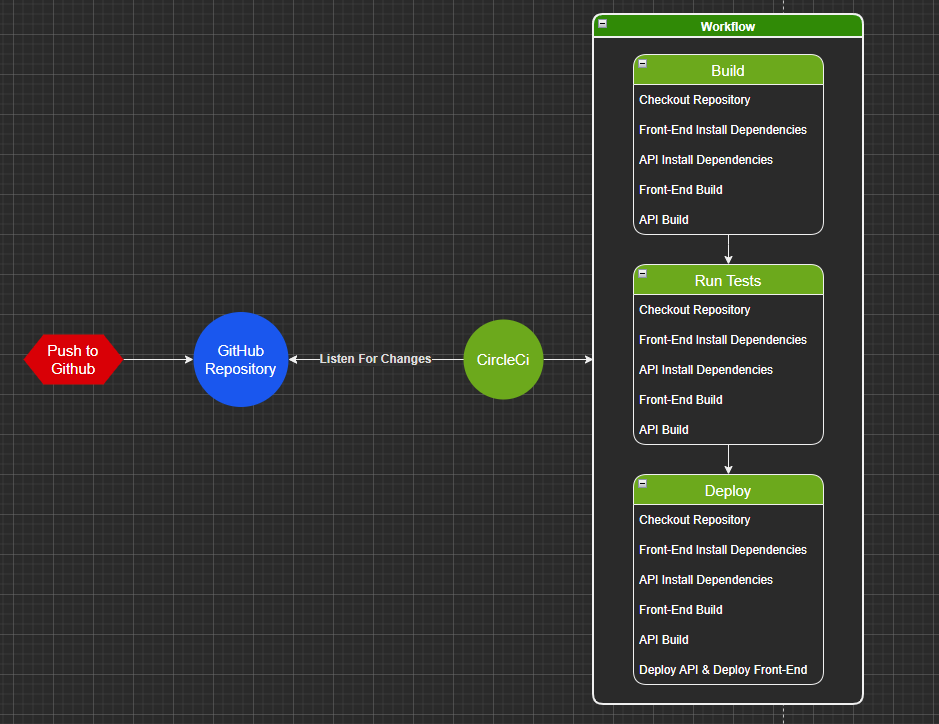

# Pipeline Process

## Pipeline Diagram

### Workflow

#### Build

The two apps are build seperately to check if building happens successfully.

#### Test

Backend Tests are ran first, these tests are relyant on the database too be up and running.

Front-End Tests are initiated and run, but at the moment does not serve any

#### Deploy

`HOLD`
To initiate the deployment process the CI requeres manual approvement too continue.
