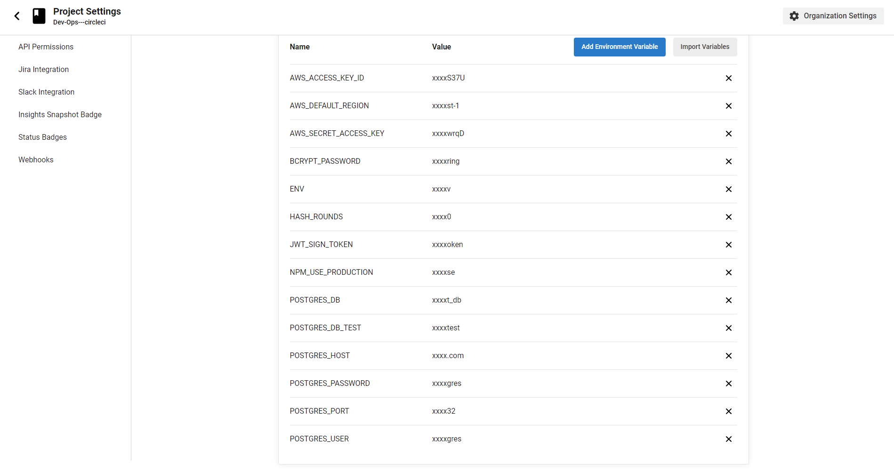

# Dev-Ops---circleci

## Project Overview

This is the Dev-Ops project that connects an angular Front-End with an Express backend. included is the CI process and documentation on this process.

## Access The App

Frontend (hosted on S3 Buckit):  
http://ecommerse-frontend---angular941266980980.s3-website-us-east-1.amazonaws.com

Working app:


## AWS infrastructure for the web application

### S3 Buckit ( Front-End )


### EB Environment ( Backend )


### RDS ( Database )


---

## Configuring Continuous Integration Pipeline with Github

Successfull pipeline


Build Stage:


Test Stage:


Deploy Stage:


All secrets are found within the CI Software


---

## Installation

### Step 1: Software

make sure you have the following installed:  
aws cli  
eb cli

### Step 2: Clone Repository

```bash
git clone --recurse-submodules https://github.com/XsAndre-L/Dev-Ops---circleci.git
```
